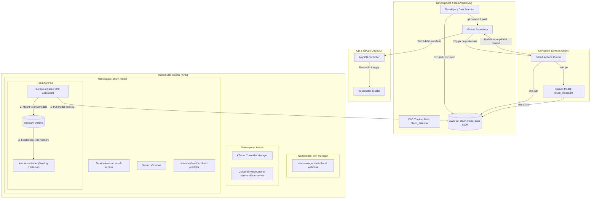
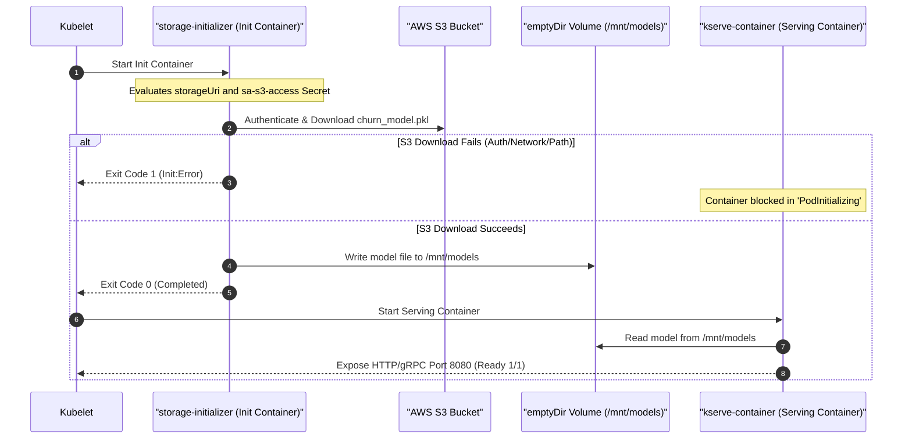

# Customer Churn Prediction: End-to-End MLOps Deployment Guide

This documentation provides a comprehensive, production-grade guide for operationalizing, serving, and automating the deployment of the **Customer Churn Prediction Model** using **DVC**, **AWS S3**, **Kubernetes (KinD)**, **KServe**, and **ArgoCD (GitOps)**.

---

## Table of Contents

1. [Architecture & Namespace Overview](#1-architecture--namespace-overview)
2. [Local Environment & API Testing](#2-local-environment--api-testing)
3. [Data & Model Versioning (DVC + AWS S3)](#3-data--model-versioning-dvc--aws-s3)
4. [Kubernetes Cluster Provisioning (KinD)](#4-kubernetes-cluster-provisioning-kind)
5. [Prerequisites: cert-manager Installation](#5-prerequisites-cert-manager-installation)
6. [KServe v0.20.0 Installation & Runtime Configuration](#6-kserve-v0200-installation--runtime-configuration)
7. [Model Deployment: ServiceAccount & InferenceService](#7-model-deployment-serviceaccount--inferenceservice)
8. [GitOps Continuous Delivery with ArgoCD](#8-gitops-continuous-delivery-with-argocd)
9. [Deep Dive: Troubleshooting Pod Multi-Container Architecture & Init:Error](#9-deep-dive-troubleshooting-pod-multi-container-architecture--initerror)
10. [Verification Guide: Tracking Deployments Across All Levels](#10-verification-guide-tracking-deployments-across-all-levels)

---

## 1. Architecture & Namespace Overview

The system follows a modern MLOps GitOps workflow:



### Namespace Separation

| Namespace | Components Deployed | Purpose |
| :--- | :--- | :--- |
| `cert-manager` | cert-manager controller, cainjector, webhook | Manages TLS certificates required by KServe admission webhooks |
| `kserve` | KServe CRDs, controller manager | Manages `InferenceService` lifecycle and serving runtimes |
| `argocd` | ArgoCD server, repo-server, application-controller | Automates synchronization of Git manifests to cluster state |
| `churn-model` | `churn-predictor`, `sa-s3-access`, `s3-secret` | Dedicated workload namespace for model inference workloads |

---

## 2. Local Environment & API Testing

The project uses `uv` for fast, reproducible Python environment management.

### 2.1 Dependency Installation

```bash
# Install base requirements
uv pip install -r requirements.txt

# Add DVC and AWS botocore acceleration
uv add dvc
uv add "botocore[crt]"
```

### 2.2 Local API Verification (FastAPI + Uvicorn)

Run the local FastAPI server defined in `api.py`:

```bash
uvicorn api:app --host 0.0.0.0 --port 8000 --reload
```

Test the health and prediction endpoints:

```bash
# Health check
curl http://localhost:8000/health

# Prediction request
curl -X POST http://localhost:8000/predict \
  -H "Content-Type: application/json" \
  -d '{
    "age": 45,
    "tenure_months": 24,
    "monthly_charges": 79.99,
    "total_charges": 1920.00,
    "num_support_calls": 3
  }'
```

Expected response:
```json
{
  "churn": 1,
  "churn_probability": 0.73
}
```

---

## 3. Data & Model Versioning (DVC + AWS S3)

To ensure model reproducibility and avoid committing large binaries into Git, datasets and model artifacts are versioned via DVC and AWS S3.

### 3.1 Initialize DVC & Configure S3 Remote

```bash
# Initialize DVC in the repo root
dvc init

# Configure S3 as default remote storage
dvc remote add -d s3remote s3://churn-model-data-9109

# Verify remote configuration
dvc remote list
```

### 3.2 Track Data & Push to S3

```bash
# Track dataset
dvc add ./data/churn_data.csv

# Commit DVC metadata to Git
git add data/churn_data.csv.dvc data/.gitignore
git commit -m "chore: track churn_data.csv with DVC"

# Authenticate with AWS CLI
aws configure
# Or via SSO:
aws login

# Push data to S3
dvc push
```

### 3.3 Upload Model to S3

Train the model and push the serialized pickle file to S3:

```bash
# Generate data and train model
python generate_data.py
python train.py

# Push model artifact to S3 bucket
aws s3 cp models/churn_model.pkl s3://churn-model-data-9109/models/churn_model.pkl
```

---

## 4. Kubernetes Cluster Provisioning (KinD)

We use **KinD** (Kubernetes in Docker) to spin up a local Kubernetes v1.30.0 cluster:

```bash
# Create KinD cluster
kind create cluster --name churn-model --image kindest/node:v1.30.0

# Verify cluster connection
kubectl cluster-info --context kind-churn-model
kubectl get nodes
```

---

## 5. Prerequisites: cert-manager Installation

KServe requires valid TLS certificates to register its validating and mutating admission webhooks. `cert-manager` automates this process.

```bash
# Add Jetstack Helm repository
helm repo add jetstack https://charts.jetstack.io
helm repo update

# Install cert-manager with Custom Resource Definitions (CRDs)
helm install cert-manager jetstack/cert-manager \
  --namespace cert-manager \
  --create-namespace \
  --set crds.enabled=true

# Verify cert-manager pods are Running
kubectl get pods -n cert-manager
```

Expected output:
```text
NAME                                       READY   STATUS    RESTARTS   AGE
cert-manager-56b856554b-xxxx               1/1     Running   0          45s
cert-manager-cainjector-859746fbb9-yyyy    1/1     Running   0          45s
cert-manager-webhook-777b7f5869-zzzz       1/1     Running   0          45s
```

---

## 6. KServe v0.20.0 Installation & Runtime Configuration

KServe is deployed in **Standard (RawDeployment)** mode, eliminating the dependency on Knative Serving and Istio for environments where standard Kubernetes Deployments and Services are preferred.

### 6.1 Install KServe CRDs and Controller

```bash
# Create kserve namespace
kubectl create namespace kserve

# 1. Install KServe CRDs
helm install kserve-crd oci://ghcr.io/kserve/charts/kserve-crd \
  --version v0.20.0 \
  -n kserve \
  --wait

# Verify CRD installation
kubectl get crds | grep kserve

# 2. Install KServe Resources (Standard / RawDeployment mode)
helm install kserve oci://ghcr.io/kserve/charts/kserve-resources \
  --version v0.20.0 \
  --set kserve.controller.deploymentMode=Standard \
  -n kserve \
  --wait

# Verify KServe controller is Running
kubectl get pods -n kserve
```

### 6.2 Configure ClusterServingRuntime for Scikit-Learn

Install the default `kserve-sklearnserver` runtime and ensure the image tag matches the installed KServe version:

```bash
# Apply official runtime manifest
kubectl apply -f https://raw.githubusercontent.com/kserve/kserve/v0.20.0/config/runtimes/kserve-sklearnserver.yaml

# Verify runtime exists
kubectl get clusterservingruntimes
```

If image adjustment is needed:
```bash
kubectl edit clusterservingruntime kserve-sklearnserver
```
Ensure the container spec contains:
```yaml
containers:
  - image: kserve/sklearnserver:v0.20.0
    name: kserve-container
```

---

## 7. Model Deployment: ServiceAccount & InferenceService

### 7.1 Namespace, Secret, and ServiceAccount (`k8s/serviceaccount.yaml`)

KServe uses Kubernetes `ServiceAccount` annotations to automatically inject cloud storage credentials into the `storage-initializer` init container.

File: `k8s/serviceaccount.yaml`:
```yaml
apiVersion: v1
kind: Namespace
metadata:
  name: churn-model
---
apiVersion: v1
kind: Secret
metadata:
  name: s3-secret
  namespace: churn-model
  annotations:
    serving.kserve.io/s3-endpoint: s3.amazonaws.com
    serving.kserve.io/s3-usehttps: "1"
    serving.kserve.io/s3-region: eu-north-1
type: Opaque
stringData:
  AWS_ACCESS_KEY_ID: "<YOUR_AWS_ACCESS_KEY_ID>"
  AWS_SECRET_ACCESS_KEY: "<YOUR_AWS_SECRET_ACCESS_KEY>"
---
apiVersion: v1
kind: ServiceAccount
metadata:
  name: sa-s3-access
  namespace: churn-model
secrets:
- name: s3-secret
```

Apply the configuration:
```bash
kubectl apply -f k8s/serviceaccount.yaml
```

> [!CAUTION]
> Never commit plaintext AWS secret access keys to public Git repositories. Use sealed-secrets, external-secrets-operator, or populate secrets out-of-band.

### 7.2 Deploy InferenceService (`k8s/inference.yaml`)

File: `k8s/inference.yaml`:
```yaml
apiVersion: serving.kserve.io/v1beta1
kind: InferenceService
metadata:
  name: churn-predictor
  namespace: churn-model
spec:
  predictor:
    serviceAccountName: sa-s3-access
    sklearn:
      storageUri: s3://churn-model-data-9109/models/churn_model.pkl
```

Deploy the model:
```bash
kubectl apply -f k8s/inference.yaml
```

### 7.3 Verification and Port-Forwarding

Check status of InferenceService and underlying Pod:
```bash
# Check InferenceService readiness
kubectl get inferenceservice -n churn-model

# Check Pods
kubectl get pods -n churn-model

# Check Kubernetes Service
kubectl -n churn-model get service
```

Port-forward the predictor service:
```bash
kubectl -n churn-model port-forward service/churn-predictor-predictor 8080:80
```

### 7.4 Testing Predictions (KServe v1 Dataplane Protocol)

With the port-forward active, send an inference payload using KServe's standard v1 protocol endpoint (`/v1/models/<model-name>:predict`):

```bash
curl -X POST http://localhost:8080/v1/models/churn-predictor:predict \
  -H "Content-Type: application/json" \
  -d '{
    "instances": [
      [45, 24, 79.99, 1920.00, 3]
    ]
  }'
```

Expected response:
```json
{
  "predictions": [1]
}
```

---

## 8. GitOps Continuous Delivery with ArgoCD

ArgoCD continuously monitors the Git repository and synchronizes the cluster state whenever manifests in `k8s/` change.

### 8.1 ArgoCD Installation

```bash
# Create namespace
kubectl create namespace argocd

# Install ArgoCD components
kubectl apply -n argocd --server-side --force-conflicts \
  -f https://raw.githubusercontent.com/argoproj/argo-cd/stable/manifests/install.yaml

# Verify services
kubectl get svc -n argocd
```

### 8.2 Expose Dashboard & Retrieve Admin Password

```bash
# Port-forward the ArgoCD API/Web UI server
kubectl port-forward svc/argocd-server 7003:80 --address 0.0.0.0 -n argocd
```

In another terminal, retrieve and decode the initial admin password:

```bash
kubectl get secret argocd-initial-admin-secret -n argocd -o jsonpath="{.data.password}" | base64 --decode && echo
```

Access the UI at: **`http://localhost:7003`**
- **Username:** `admin`
- **Password:** `<decoded password from command above>`

### 8.3 Register ArgoCD Application

You can register the application via the ArgoCD Web UI or via the following declarative manifest:

```yaml
apiVersion: argoproj.io/v1alpha1
kind: Application
metadata:
  name: customer-churn-model
  namespace: argocd
spec:
  project: default
  source:
    repoURL: https://github.com/LikhithST/customer-churn-model.git
    targetRevision: main
    path: k8s
  destination:
    server: https://kubernetes.default.svc
    namespace: churn-model
  syncPolicy:
    automated:
      prune: true
      selfHeal: true
    syncOptions:
      - CreateNamespace=true
```

Apply the application:
```bash
kubectl apply -f argocd-app.yaml
```

### 8.4 Automated CI/CD Lifecycle

The GitHub Actions workflow (`.github/workflows/mlops-pipeline.yaml`) ties the entire loop together:
1. Triggered on `git push` to `main`.
2. Downloads training data using `dvc pull`.
3. Retrains model with `python train.py`.
4. Uploads versioned model to S3: `s3://${S3_BUCKET}/models/churn_model_v_${GITHUB_RUN_ID}.pkl`.
5. Updates `storageUri` in `k8s/inference.yaml` with `sed`.
6. Commits and pushes changes back to GitHub.
7. ArgoCD detects the new commit in `main`, updates the cluster, and triggers a rolling update of the `churn-predictor` pod.

---

## 9. Deep Dive: Troubleshooting Pod Multi-Container Architecture & Init:Error

### 9.1 Understanding the Error Scenario

During initial rollout or after an S3 update, you may encounter the following error state:

```text
$ kubectl get pods -n churn-model
NAME                                         READY   STATUS       RESTARTS      AGE
churn-predictor-predictor-78b5ccd88d-dxdsm   0/1     Init:Error   3 (35s ago)   58s
```

When trying to view the pod logs directly:
```text
$ kubectl logs churn-predictor-predictor-78b5ccd88d-dxdsm -n churn-model
Defaulted container "kserve-container" out of: kserve-container, storage-initializer (init)
Error from server (BadRequest): container "kserve-container" in pod "churn-predictor-predictor-78b5ccd88d-dxdsm" is waiting to start: PodInitializing
```

### 9.2 The Two Containers Explained

Every KServe Predictor pod contains **two distinct containers**:



#### 1. `storage-initializer` (Init Container)
- **Role:** Executes before any application containers start. It inspects the `storageUri` specified in `InferenceService`, extracts the S3 bucket and object key, retrieves credentials from the linked `ServiceAccount` and `Secret`, downloads the model artifact from S3, and writes it into a shared `emptyDir` volume mounted at `/mnt/models`.
- **Why it failed (`Init:Error`):** An init container failure halts the pod startup. Because the exit code is non-zero, Kubernetes marks the pod status as `Init:Error` or `Init:CrashLoopBackOff`.
- **How to inspect:**
  ```bash
  kubectl logs <pod-name> -c storage-initializer -n churn-model
  ```

#### 2. `kserve-container` (Main Serving Container)
- **Role:** The scikit-learn model server. It mounts the shared volume at `/mnt/models`, loads the model into memory, and spins up the HTTP/gRPC prediction server.
- **Why `kubectl logs` failed with `PodInitializing`:** In Kubernetes, `kubectl logs <pod>` defaults to the main application container (`kserve-container`). Since an init container failed to complete, the main container has not even been scheduled to start; it is waiting in `PodInitializing` state.
- **How to inspect:**
  ```bash
  kubectl logs <pod-name> -c kserve-container -n churn-model
  ```
  *(Will only return logs once `storage-initializer` has succeeded).*

### 9.3 Root Cause Diagnostics & Solutions for `Init:Error`

Inspect the logs of `storage-initializer`:
```bash
kubectl logs -l serving.kserve.io/inferenceservice=churn-predictor -n churn-model -c storage-initializer
```

Common root causes and fixes:

| Error Message in `storage-initializer` | Root Cause | Solution |
| :--- | :--- | :--- |
| `botocore.exceptions.ClientError: An error occurred (403) when calling the HeadObject operation: Forbidden` | Missing S3 IAM permissions or invalid AWS credentials | Update `k8s/serviceaccount.yaml` with valid `AWS_ACCESS_KEY_ID` and `AWS_SECRET_ACCESS_KEY` that have `s3:GetObject` and `s3:ListBucket` permissions. |
| `botocore.exceptions.ClientError: An error occurred (404) when calling the HeadObject operation: Not Found` | Model file does not exist at specified path in S3 | Check `storageUri` in `k8s/inference.yaml`. Ensure the file was uploaded via `aws s3 cp` and the path matches exactly. |
| `botocore.exceptions.EndpointConnectionError: Could not connect to the endpoint URL` | Wrong region annotation or network egress blocked | Check `serving.kserve.io/s3-region` in `s3-secret`. Set to correct bucket region (e.g., `eu-north-1`). |
| `storageUri not supported` | Typo in protocol schema | Must start with `s3://`, `gs://`, `pvc://`, or `https://`. |

After fixing secrets or manifests:
```bash
# Update secret
kubectl apply -f k8s/serviceaccount.yaml

# Restart pod to trigger re-initialization
kubectl rollout restart deployment/churn-predictor-predictor -n churn-model
```

---

## 10. Verification Guide: Tracking Deployments Across All Levels

When an automated deployment is triggered via GitHub Actions, how do you verify that ArgoCD recognized the new commit and successfully deployed it to the cluster? Here are the verification methods at all operational levels:

### Level 1: ArgoCD Web Dashboard (UI)

1. **Application Tile Status:**
   - **Sync Status:** Must show <span style="color:green;font-weight:bold;">Synced</span> (green checkmark). If it shows <span style="color:goldenrod;font-weight:bold;">OutOfSync</span>, ArgoCD detected a Git change but has not yet applied it.
   - **Health Status:** Must show <span style="color:green;font-weight:bold;">Healthy</span> (green heart).
2. **Commit SHA Verification:**
   - On the application card, verify the **Git Revision Hash** matches the latest commit pushed by GitHub Actions.
3. **Diff View:**
   - Click the **App Details** -> **Sync** button or click on the `InferenceService` resource node -> **Diff** tab.
   - Review differences between **Target State (Git)** and **Live State (Cluster)**.
4. **History and Rollback Tab:**
   - Navigate to **History and Rollback** in the left menu.
   - Verify that a new entry appears at the top with:
     - The corresponding Git commit message (`"Update InferenceService storageUri to point to the new model in S3"`).
     - Commit author (`github-actions[bot]`).
     - Timestamp of synchronization.

---

### Level 2: ArgoCD Command Line Interface (`argocd` CLI)

```bash
# 1. Check general app state, revision, and sync status
argocd app get customer-churn-model

# 2. View deployment history with commit SHAs and timestamps
argocd app history customer-churn-model

# 3. View live diff between Git repo and Kubernetes cluster
argocd app diff customer-churn-model

# 4. View active manifests being tracked
argocd app manifests customer-churn-model
```

---

### Level 3: Kubernetes Command Line Interface (`kubectl`)

You can verify the deployment directly through `kubectl` without opening ArgoCD:

#### 1. Inspect the InferenceService Resource
Check the `storageUri` and ArgoCD tracking metadata:
```bash
# Verify the storageUri matches the new model version
kubectl get inferenceservice churn-predictor -n churn-model -o jsonpath='{.spec.predictor.sklearn.storageUri}' && echo

# Check ArgoCD tracking annotations and sync revision
kubectl get inferenceservice churn-predictor -n churn-model -o yaml | grep -E "argocd.argoproj.io|storageUri"
```

#### 2. Inspect Deployment Rollout History
Check rollout status and revisions:
```bash
# Watch rollout progression
kubectl rollout status deployment/churn-predictor-predictor -n churn-model

# Check rollout revision history
kubectl rollout history deployment/churn-predictor-predictor -n churn-model
```

#### 3. Inspect ReplicaSets and Pod Generation
Every new deployment revision creates a new Kubernetes ReplicaSet:
```bash
# List all ReplicaSets ordered by creation time
kubectl get rs -n churn-model -o wide

# Check the active Pod creation time and status
kubectl get pods -n churn-model --show-labels
```

#### 4. Inspect Pod Specification & Model Environment
Verify the pod was spun up with the new configuration:
```bash
# Describe pod to see S3 storageUri passed to storage-initializer
kubectl describe pod -l serving.kserve.io/inferenceservice=churn-predictor -n churn-model | grep -A 5 "storage-initializer"
```

#### 5. Check Cluster Event Stream
Verify events ordered chronologically to observe the kill and creation cycle:
```bash
kubectl get events -n churn-model --sort-by='.metadata.creationTimestamp'
```
You should see:
- `ScalingReplicaSet`: Scaled up new ReplicaSet.
- `Created`: Created container `storage-initializer`.
- `Started`: Started container `kserve-container`.
- `Killing`: Scaled down and terminated old Pod.

---

### Level 4: End-to-End Correlation (Git SHA ↔ S3 ↔ Cluster)

To achieve 100% verification confidence across the entire pipeline:

```text
[GitHub Action Run ID: 12345]
         │
         ├──> S3 Artifact: s3://churn-model-data-9109/models/churn_model_v_12345.pkl
         │
         ├──> Git Commit SHA: "a1b2c3d" (updates k8s/inference.yaml storageUri)
         │
         ├──> ArgoCD Synced Revision: "a1b2c3d"
         │
         └──> K8s ISVC storageUri: s3://churn-model-data-9109/models/churn_model_v_12345.pkl
```

Run this one-liner verification check:
```bash
echo "=== Cluster Model URI ===" && \
kubectl get isvc churn-predictor -n churn-model -o jsonpath='{.spec.predictor.sklearn.storageUri}' && \
echo -e "\n=== ArgoCD App Revision ===" && \
kubectl get application customer-churn-model -n argocd -o jsonpath='{.status.sync.revision}' && \
echo -e "\n=== Latest Pod Start Time ===" && \
kubectl get pods -n churn-model -l serving.kserve.io/inferenceservice=churn-predictor -o jsonpath='{.items[0].status.startTime}' && \
echo ""
```
If the URI matches the GitHub run ID and the ArgoCD sync revision matches the latest Git commit, the deployment is completely validated.

